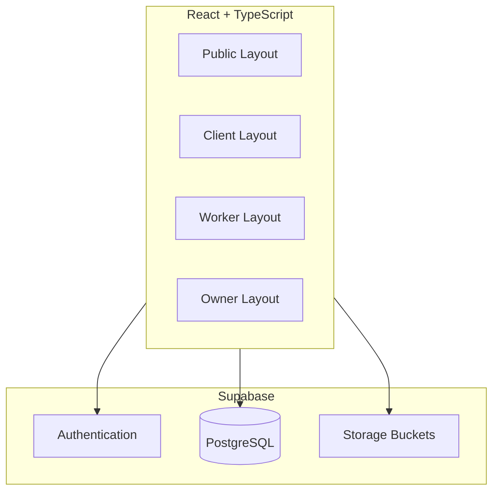
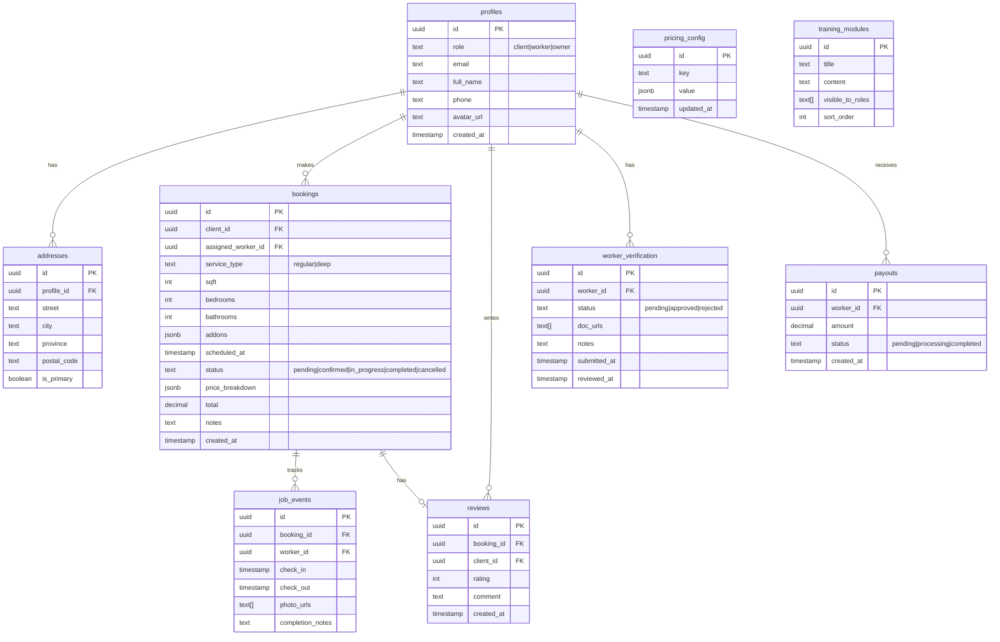

# Queren - Project Documentation

## Overview
**Queren** is a cleaning platform connecting clients with vetted freelance cleaners. It consists of three role-based portals sharing a unified design system.

## Architecture



### Tech Stack
- **Frontend**: React 18, TypeScript, React Router v6
- **Styling**: CSS Modules (no Tailwind)
- **Backend**: Supabase (Auth, Database, Storage)
- **Build**: Vite

### Folder Structure
```
/src
├── components/        # Reusable UI components
│   ├── ui/           # Button, Input, Card, etc.
│   └── layout/       # Layout shells
├── pages/
│   ├── public/       # Marketing pages
│   ├── client/       # Client dashboard
│   ├── worker/       # Worker portal
│   └── owner/        # Owner portal
├── hooks/            # Custom React hooks
├── lib/              # Supabase client, utils
├── styles/           # Global CSS, variables
└── types/            # TypeScript definitions
```

---

## Design System

### Color Palette
| Token | Value | Usage |
|-------|-------|-------|
| `--color-primary` | `#9B7ED9` | Primary purple |
| `--color-primary-light` | `#C4B5E0` | Hover states |
| `--color-primary-dark` | `#7B5EC9` | Active states |
| `--color-bg` | `#FDFBFF` | Page background |
| `--color-bg-subtle` | `#F5F0FA` | Card backgrounds |
| `--color-text` | `#2D2D3A` | Body text |
| `--color-text-muted` | `#6B6B7B` | Secondary text |
| `--color-success` | `#4CAF50` | Success states |
| `--color-error` | `#E57373` | Error states |
| `--color-border` | `#E8E0F0` | Borders |

### Typography
```css
--font-family: 'Inter', system-ui, sans-serif;
--font-size-xs: 0.75rem;
--font-size-sm: 0.875rem;
--font-size-base: 1rem;
--font-size-lg: 1.125rem;
--font-size-xl: 1.25rem;
--font-size-2xl: 1.5rem;
--font-size-3xl: 2rem;
```

### Spacing
```css
--space-1: 0.25rem;  --space-2: 0.5rem;
--space-3: 0.75rem;  --space-4: 1rem;
--space-5: 1.5rem;   --space-6: 2rem;
--space-8: 3rem;     --space-10: 4rem;
```

### Component Standards
- **Buttons**: Fully rounded pill (`border-radius: 9999px`), min-height 44px
- **Cards**: `border-radius: 16px`, soft shadow `0 4px 20px rgba(155,126,217,0.1)`
- **Inputs**: `border-radius: 12px`, 48px height, clear focus ring
- **Transitions**: `200ms ease` for all interactive elements

### Microcopy Patterns
- ✓ "You're all set!"
- ✓ "No surprise fees"
- ✓ "You can edit this later"
- ✓ "We'll take care of the rest"

---

## Routes

### Public Routes
| Path | Page |
|------|------|
| `/` | Home |
| `/booking` | Booking Calculator |
| `/services` | Services Overview |
| `/services/regular` | Regular Cleaning |
| `/services/deep` | Deep Cleaning |
| `/services/pricing` | Pricing & Rates |
| `/about` | About Us |
| `/about/story` | Our Story |
| `/about/areas` | Service Areas |
| `/about/values` | Our Values |
| `/about/careers` | Careers |
| `/faq` | FAQ |
| `/policies` | Policies |
| `/contact` | Contact |
| `/login` | Login |
| `/signup` | Sign Up |
| `/forgot-password` | Password Reset |

### Client Portal (`/dashboard/*`)
| Path | Page |
|------|------|
| `/dashboard` | Overview |
| `/dashboard/profile` | Profile Settings |
| `/dashboard/billing` | Billing & Payments |
| `/dashboard/history` | Service History |
| `/dashboard/preferences` | Cleaning Preferences |

### Worker Portal (`/worker/*`)
| Path | Page |
|------|------|
| `/worker` | Dashboard |
| `/worker/onboarding` | Onboarding & Verification |
| `/worker/jobs` | Available Jobs |
| `/worker/schedule` | My Schedule |
| `/worker/tracking` | Time Tracking |
| `/worker/earnings` | Earnings & Payments |
| `/worker/training` | Training Hub |
| `/worker/profile` | Profile Settings |

### Owner Portal (`/owner/*`)
| Path | Page |
|------|------|
| `/owner` | Dashboard (KPIs) |
| `/owner/bookings` | Bookings Management |
| `/owner/cleaners` | Cleaners Management |
| `/owner/pricing` | Pricing Config |
| `/owner/revenue` | Revenue & Payroll |
| `/owner/reviews` | Reviews Overview |
| `/owner/support` | Support Queue |

---

## Data Model

### Entity Relationship Diagram


---

## Authentication & Authorization

### Roles
| Role | Access |
|------|--------|
| `client` | Public pages, booking, client dashboard |
| `worker` | Worker portal only |
| `owner` | Owner portal, can view all data |

### Row Level Security (RLS) Policies
```sql
-- Profiles: Users can only read/update their own profile
CREATE POLICY "Users can view own profile" ON profiles
  FOR SELECT USING (auth.uid() = id);

-- Bookings: Clients see own bookings, workers see assigned, owners see all
CREATE POLICY "Booking access" ON bookings
  FOR SELECT USING (
    auth.uid() = client_id OR 
    auth.uid() = assigned_worker_id OR
    EXISTS (SELECT 1 FROM profiles WHERE id = auth.uid() AND role = 'owner')
  );

-- Workers can only insert job_events for their assigned bookings
CREATE POLICY "Worker job events" ON job_events
  FOR INSERT WITH CHECK (
    auth.uid() = worker_id AND
    EXISTS (SELECT 1 FROM bookings WHERE id = booking_id AND assigned_worker_id = auth.uid())
  );
```

---

## Pricing Engine

### Formula
```typescript
interface PriceBreakdown {
  base: number;
  sqftCharge: number;
  roomCharge: number;
  addons: { name: string; price: number }[];
  subtotal: number;
  tax: number;
  total: number;
}

// Base rates (from pricing_config table)
const BASE_REGULAR = 89;
const BASE_DEEP = 149;
const SQFT_RATE = 0.03;  // per sqft over 1000
const BEDROOM_RATE = 15;
const BATHROOM_RATE = 20;
const TAX_RATE = 0.13;   // 13% HST

// Addons
const ADDONS = {
  fridge: 25,
  oven: 30,
  dishes: 15,
  cabinets: 40,
  laundry: 20,
};
```

---

## QA Checklist

### Functional
- [ ] User can sign up / login / reset password
- [ ] Booking calculator updates live as inputs change
- [ ] Sticky summary stays visible during scroll
- [ ] Booking creates record in database
- [ ] Client sees booking in dashboard
- [ ] Worker can accept/decline jobs
- [ ] Time tracking records check-in/out
- [ ] Owner dashboard shows accurate KPIs

### UI/UX
- [ ] All buttons are pill-shaped
- [ ] Purple color palette consistent
- [ ] Mobile responsive (< 768px)
- [ ] Loading states shown
- [ ] Error messages clear and friendly
- [ ] Empty states have helpful messaging

### Accessibility
- [ ] All inputs have labels
- [ ] Focus states visible
- [ ] Color contrast passes WCAG AA
- [ ] Keyboard navigation works

---

## Local Development

```bash
# Install dependencies
npm install

# Set up environment variables
cp .env.example .env.local
# Add VITE_SUPABASE_URL and VITE_SUPABASE_ANON_KEY

# Run development server
npm run dev
```
